# WebWright

> AI-powered browser automation that crafts seamless web interactions

[](LICENSE)
[](https://nodejs.org)

**WebWright** is a unified browser automation framework designed for AI agents. It combines ref-based element targeting, daemon-based architecture, and MCP integration for seamless AI-browser interactions.

## Architecture

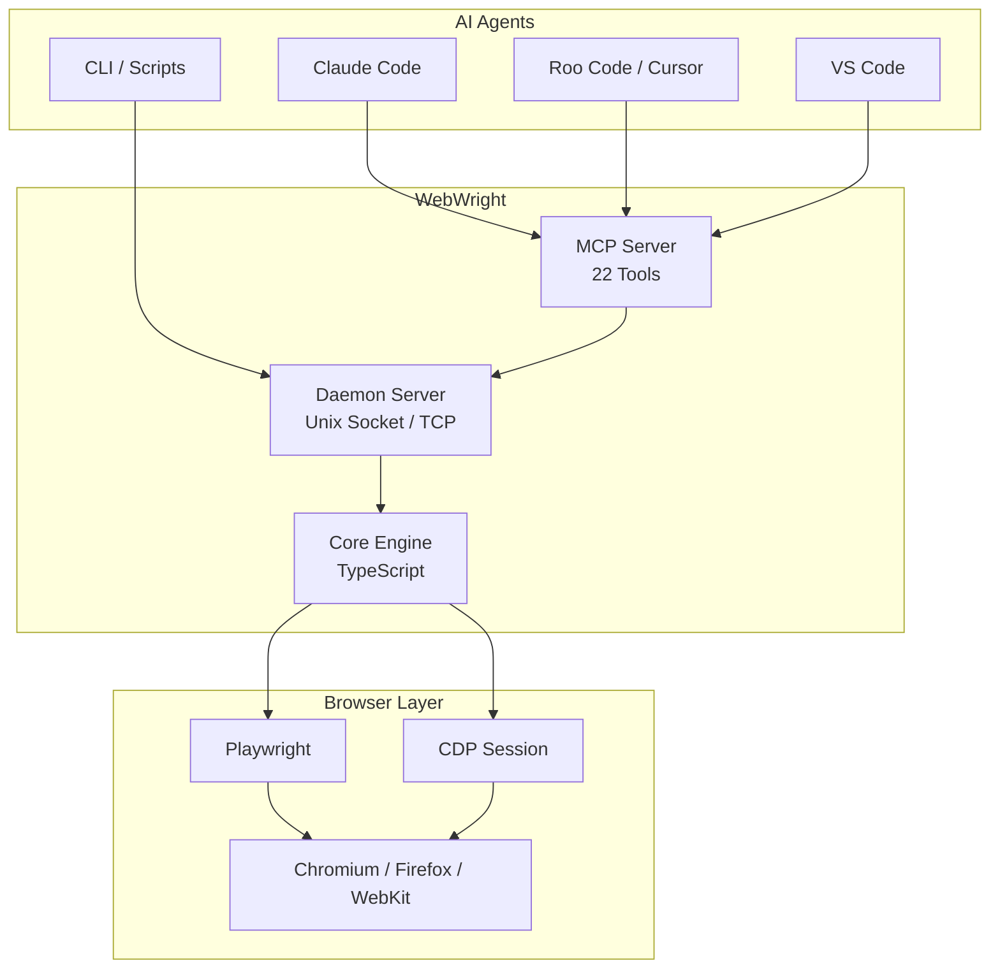

## How It Works

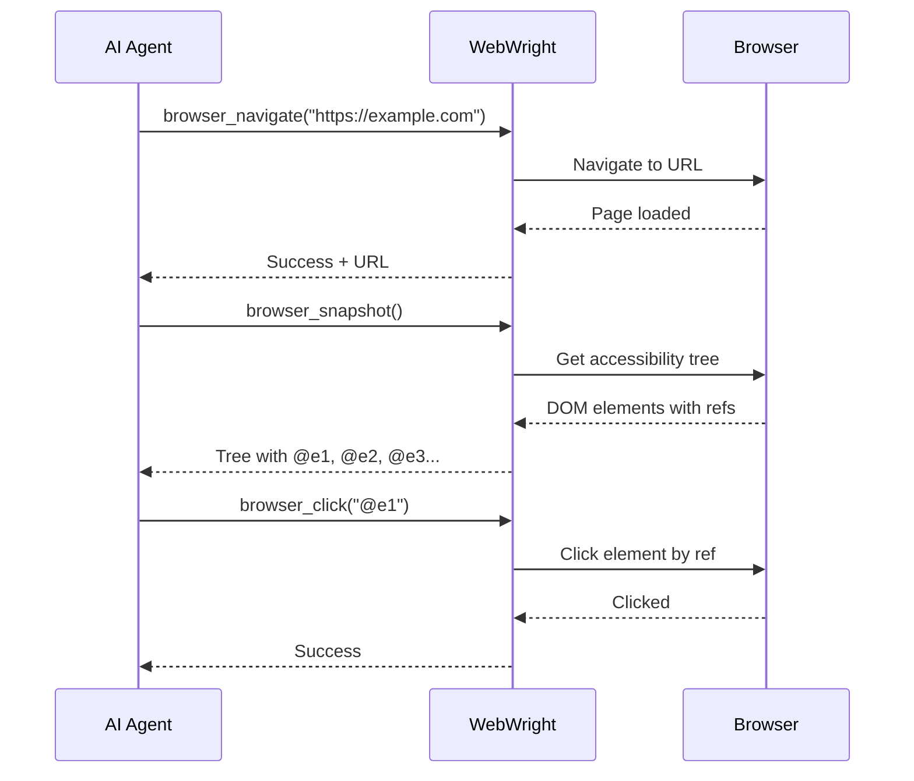

## Installation

```bash
# Global installation
npm install -g webwright

# Or use directly
npx webwright --help

# Install Playwright browsers
npx playwright install chromium
```

## Quick Start

### CLI Usage

```bash
# Navigate to a URL
webwright navigate https://example.com

# Get accessibility tree with element refs
webwright snapshot

# Click an element using ref
webwright click @e1

# Fill a form field
webwright fill @e2 "hello@example.com"

# Take a screenshot
webwright screenshot output.png
```

### With Claude Code

After [configuring MCP](#claude-code-integration), just tell Claude:

```
Navigate to https://news.ycombinator.com and find the top 3 stories
```

Claude will use WebWright's MCP tools automatically.

---

## Examples & Use Cases

### Example 1: Web Search

**What it does:** Search Google and extract results

**How to prompt it:**
```
Search Google for "best TypeScript libraries 2024" and tell me the top 5 results with their URLs
```

**What happens:**
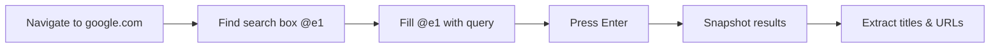

**CLI equivalent:**
```bash
webwright navigate https://google.com
webwright snapshot -i              # Get interactive elements
webwright fill @e1 "best TypeScript libraries 2024"
webwright press Enter
webwright snapshot                 # Get search results
```

---

### Example 2: Form Filling

**What it does:** Fill out a contact form automatically

**How to prompt it:**
```
Go to https://httpbin.org/forms/post and fill out the form with:
- Customer name: John Doe
- Telephone: 555-123-4567
- Email: john@example.com
- Size: Large
Then submit the form and show me the response
```

**What happens:**
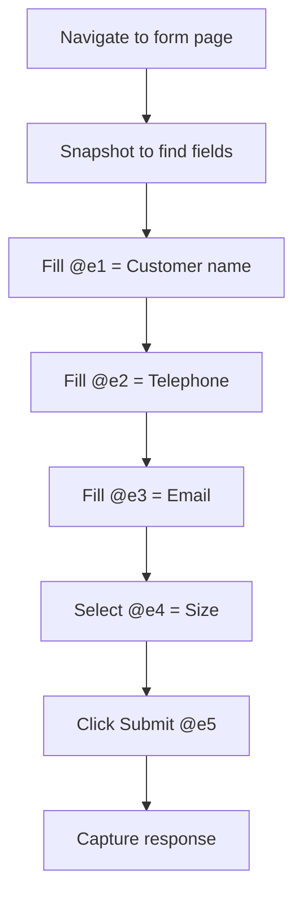

**CLI equivalent:**
```bash
webwright navigate https://httpbin.org/forms/post
webwright snapshot -i
webwright fill @e1 "John Doe"
webwright fill @e2 "555-123-4567"
webwright fill @e3 "john@example.com"
webwright select @e4 "large"
webwright click @e5
webwright snapshot
```

---

### Example 3: Multi-Page Navigation

**What it does:** Navigate through multiple pages collecting data

**How to prompt it:**
```
Go to Hacker News, click on the first article, then go back and click on the second article.
Tell me the titles of both articles.
```

**What happens:**
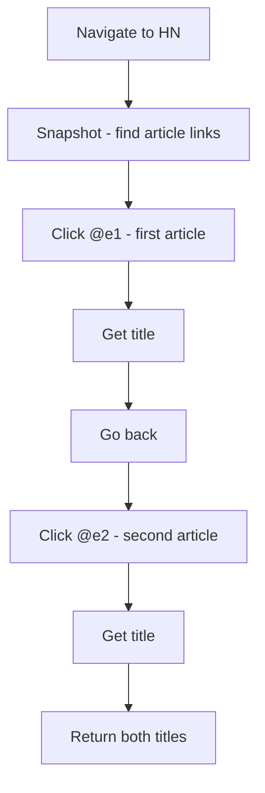

**CLI equivalent:**
```bash
webwright navigate https://news.ycombinator.com
webwright snapshot -i
webwright click @e1
webwright snapshot
# Note the title
webwright back
webwright click @e2
webwright snapshot
# Note the title
```

---

### Example 4: E-Commerce Workflow

**What it does:** Browse products and add to cart

**How to prompt it:**
```
Go to an e-commerce demo site, search for "laptop", click on the first result,
and add it to the cart. Then show me what's in the cart.
```

**What happens:**
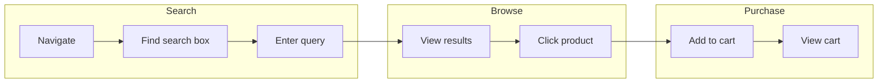

---

### Example 5: Authentication Flow

**What it does:** Log into a website

**How to prompt it:**
```
Go to https://the-internet.herokuapp.com/login
Log in with username "tomsmith" and password "SuperSecretPassword!"
Verify the login was successful
```

**What happens:**
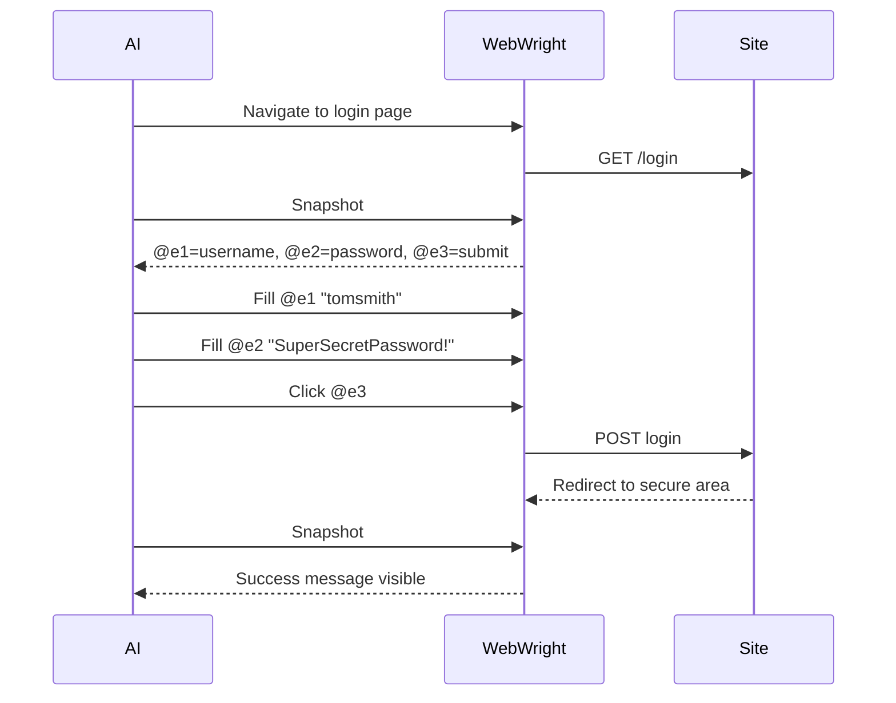

**CLI equivalent:**
```bash
webwright navigate https://the-internet.herokuapp.com/login
webwright snapshot -i
webwright fill @e1 "tomsmith"
webwright fill @e2 "SuperSecretPassword!"
webwright click @e3
webwright snapshot
```

---

### Example 6: Data Extraction

**What it does:** Scrape structured data from a webpage

**How to prompt it:**
```
Go to https://books.toscrape.com and extract the titles and prices of the first 5 books.
Present the data in a table format.
```

**What happens:**
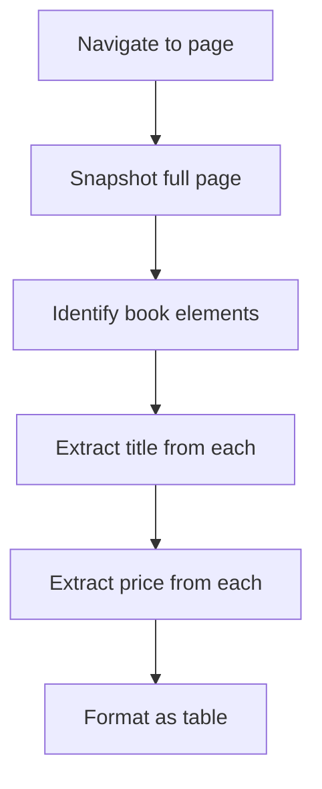

---

### Example 7: Screenshot Documentation

**What it does:** Take screenshots of different page states

**How to prompt it:**
```
Navigate to https://example.com, take a screenshot called "homepage.png",
click the "More information" link, and take another screenshot called "info-page.png"
```

**CLI equivalent:**
```bash
webwright navigate https://example.com
webwright screenshot homepage.png
webwright click @e1
webwright screenshot info-page.png
```

---

### Example 8: Multi-Tab Workflow

**What it does:** Work with multiple browser tabs

**How to prompt it:**
```
Open Google in one tab and Bing in another tab.
Search for "WebWright" in both search engines and compare the results.
```

**What happens:**
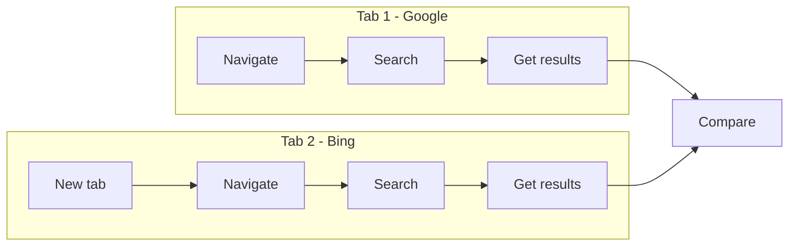

---

## Ref-Based Element Targeting

WebWright uses a **ref system** for reliable element targeting. This is the key innovation that makes it AI-friendly.

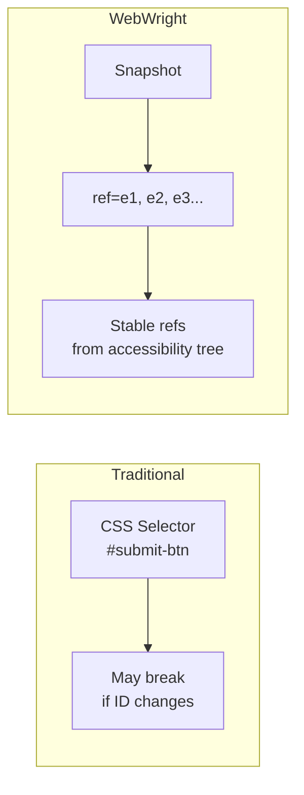

### How Refs Work

1. **Take a snapshot** - WebWright reads the accessibility tree
2. **Get refs** - Each interactive element gets a ref (e1, e2, e3...)
3. **Use refs** - Target elements with `@e1`, `@e2`, etc.

**Snapshot output:**
```yaml
- heading "Example Domain" [ref=e1] [level=1]
- paragraph: Some descriptive text
- link "More information..." [ref=e2]
- form:
  - textbox "Email" [ref=e3]
  - textbox "Password" [ref=e4]
  - button "Sign In" [ref=e5]
```

**Using refs:**
```bash
webwright click @e5           # Click the Sign In button
webwright fill @e3 "user@example.com"  # Fill the Email field
```

### Why Refs Are Better for AI

| Traditional Selectors | Ref-Based |
|----------------------|-----------|
| `#submit-btn` - May not exist | `@e1` - Always from current page |
| `.btn-primary` - Multiple matches | `@e2` - Unique per snapshot |
| `button[type=submit]` - Complex | `@e3` - Simple, consistent |
| Breaks when HTML changes | Stable within session |

---

## MCP Integration

### Claude Code Integration

Add to `~/.claude/settings.json`:

```json
{
  "mcpServers": {
    "webwright": {
      "command": "npx",
      "args": ["-y", "webwright", "mcp"]
    }
  }
}
```

Or for local development:

```json
{
  "mcpServers": {
    "webwright": {
      "command": "node",
      "args": ["/path/to/webwright/bin/agentbrowser-pro", "mcp"]
    }
  }
}
```

### VS Code Integration

Add to `.vscode/settings.json`:

```json
{
  "claude.mcp.servers": {
    "webwright": {
      "command": "npx",
      "args": ["-y", "webwright", "mcp"],
      "transport": "stdio"
    }
  }
}
```

### Cursor / Roo Code Integration

Add to `.cursor/mcp.json`:

```json
{
  "mcpServers": {
    "webwright": {
      "command": "npx",
      "args": ["-y", "webwright", "mcp"]
    }
  }
}
```

---

## Available MCP Tools

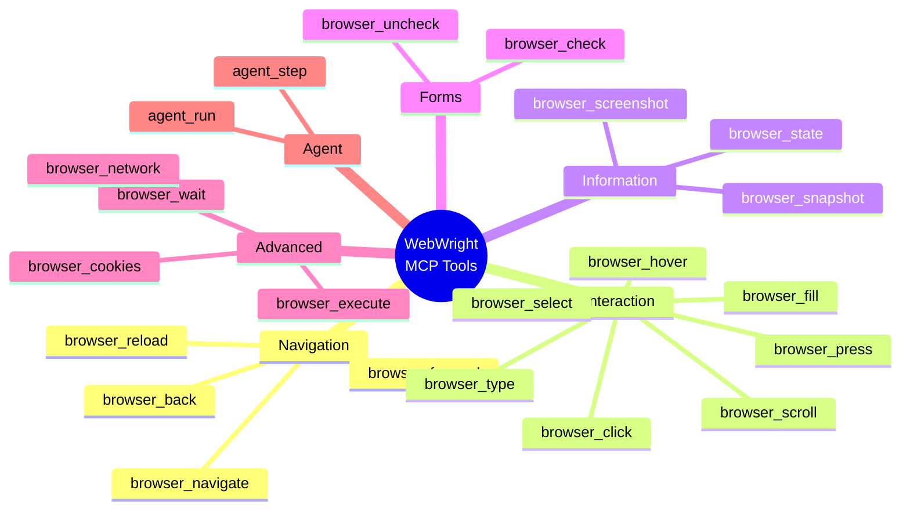

### Tool Reference

| Tool | Description | Parameters |
|------|-------------|------------|
| `browser_navigate` | Navigate to URL | `url` |
| `browser_click` | Click element | `target` (ref or selector) |
| `browser_type` | Type text (preserves existing) | `target`, `text` |
| `browser_fill` | Fill input (clears first) | `target`, `value` |
| `browser_scroll` | Scroll page/element | `direction`, `amount` |
| `browser_snapshot` | Get accessibility tree | `interactive` (optional) |
| `browser_screenshot` | Take screenshot | `path` (optional) |
| `browser_state` | Get URL/title/viewport | - |
| `browser_back` | Go back in history | - |
| `browser_forward` | Go forward in history | - |
| `browser_reload` | Reload page | - |
| `browser_wait` | Wait for selector/timeout | `selector` or `timeout` |
| `browser_execute` | Execute JavaScript | `script` |
| `browser_select` | Select dropdown option | `target`, `value` |
| `browser_check` | Check checkbox | `target` |
| `browser_uncheck` | Uncheck checkbox | `target` |
| `browser_hover` | Hover element | `target` |
| `browser_press` | Press keyboard key | `key` |
| `browser_cookies` | Get/set/clear cookies | `action`, `name`, `value` |
| `browser_network` | Intercept network | `url`, `response` |
| `agent_run` | Run autonomous agent | `task` |
| `agent_step` | Execute single step | `action` |

---

## Advanced Features

WebWright includes advanced browser automation features adapted from browser-use for AI-powered workflows.

### Human-Like Interactions

**Human Click** - Mimics human clicking behavior with jitter and timing delays:

```typescript
// Human-like click with random position jitter and realistic timing
await executor.execute({
  id: 'human-1',
  action: 'humanClick',
  selector: 'button#submit',
  jitter: 3,                    // Random offset in pixels
  preDelay: [30, 80],          // Wait 30-80ms before click
  postDelay: [50, 150],        // Wait 50-150ms after click
});
```

**Multi-Strategy Clear** - Clears input fields using 4 fallback strategies:

```typescript
// Try multiple strategies to clear a field
await executor.execute({
  id: 'clear-1',
  action: 'multiClear',
  selector: 'input#email',
  triggerFrameworkEvents: true,  // Trigger React/Vue/Angular events
});
// Strategies: 1) Playwright clear, 2) Triple-click+Delete,
// 3) Ctrl+A+Delete, 4) JS fallback with events
```

### AI-Powered Data Extraction

**Extract Content** - Extract structured data from pages:

```typescript
await executor.execute({
  id: 'extract-1',
  action: 'extract',
  goal: 'Get all product names and prices',
  maxLength: 60000,
});
// Returns markdown-formatted page content for LLM processing
```

**Detect Input Variables** - Auto-detect form field types:

```typescript
await executor.execute({
  id: 'detect-1',
  action: 'detectVariables',
  selector: 'form#checkout',  // Optional: scope to specific form
});
// Returns: email, phone, password, date, credit card, etc.
```

### Navigation Helpers

**Search** - Navigate to search engines with query:

```typescript
await executor.execute({
  id: 'search-1',
  action: 'search',
  query: 'playwright automation',
  engine: 'duckduckgo',  // or 'google', 'bing'
});
```

**Detect Pagination** - Find pagination controls automatically:

```typescript
await executor.execute({
  id: 'paginate-1',
  action: 'detectPagination',
});
// Returns: { next: [...], prev: [...], pageNumbers: [...], currentPage: 2 }
```

**Find Text on Page** - Locate text with context:

```typescript
await executor.execute({
  id: 'find-1',
  action: 'findTextOnPage',
  text: 'Terms of Service',
  caseSensitive: false,
});
// Returns matches with surrounding context and XPath selectors
```

### Health Monitoring

**Health Check** - Monitor page health status:

```typescript
await executor.execute({
  id: 'health-1',
  action: 'healthCheck',
  checkNetwork: true,      // Check for pending requests
  checkConsole: true,      // Check for console errors
  checkResponsive: true,   // Check if page responds
  timeout: 5000,
});
// Returns: { healthy: true/false, issues: [...], network: {...}, console: {...} }
```

### Stealth Mode

WebWright includes stealth mode for anti-detection when automating websites:

```typescript
await browser.launch({
  headless: true,
  stealth: true,  // Enable stealth mode (enabled by default)
});
```

**Stealth features include:**
- Navigator webdriver flag patching
- Chrome runtime object injection
- Permissions API masking
- Plugin array population
- Language detection patching
- WebGL vendor masking
- Stealth Chrome launch arguments

---

## Prompting Guide

### Effective Prompts

**Good prompts are specific and action-oriented:**

```
✅ "Navigate to github.com, search for 'webwright', and click on the first repository result"

✅ "Go to the login page at example.com/login, enter username 'test' and password 'pass123', then click submit"

✅ "Open news.ycombinator.com and extract the titles of the top 5 stories"
```

**Avoid vague prompts:**

```
❌ "Browse the web" (too vague)

❌ "Do something on Google" (no specific action)

❌ "Find information" (no target or criteria)
```

### Prompt Patterns

**Pattern 1: Navigate + Extract**
```
Go to [URL] and extract [specific data]
```

**Pattern 2: Navigate + Interact + Verify**
```
Go to [URL], [perform action], and verify [expected result]
```

**Pattern 3: Multi-Step Workflow**
```
1. Navigate to [URL]
2. Fill in [form fields]
3. Submit and [capture result]
```

**Pattern 4: Comparison**
```
Visit [Site A] and [Site B], search for [query], and compare the results
```

---

## CLI Commands

### Navigation

```bash
webwright navigate <url>     # Navigate to URL
webwright back               # Go back in history
webwright forward            # Go forward in history
webwright reload             # Reload page
```

### Interaction

```bash
webwright click <sel>        # Click element
webwright type <sel> <text>  # Type text (preserves existing)
webwright fill <sel> <val>   # Fill input (clears first)
webwright press <key>        # Press keyboard key (Enter, Tab, etc.)
webwright scroll [dir] [px]  # Scroll page
webwright hover <sel>        # Hover over element
webwright select <sel> <val> # Select dropdown option
webwright check <sel>        # Check checkbox
webwright uncheck <sel>      # Uncheck checkbox
```

### Information

```bash
webwright snapshot           # Get accessibility tree with refs
webwright screenshot [path]  # Take screenshot
```

### Options

```bash
--session=<name>       # Named session (default: "default")
--headed               # Run browser visibly
--json                 # Output as JSON
```

---

## Daemon Architecture

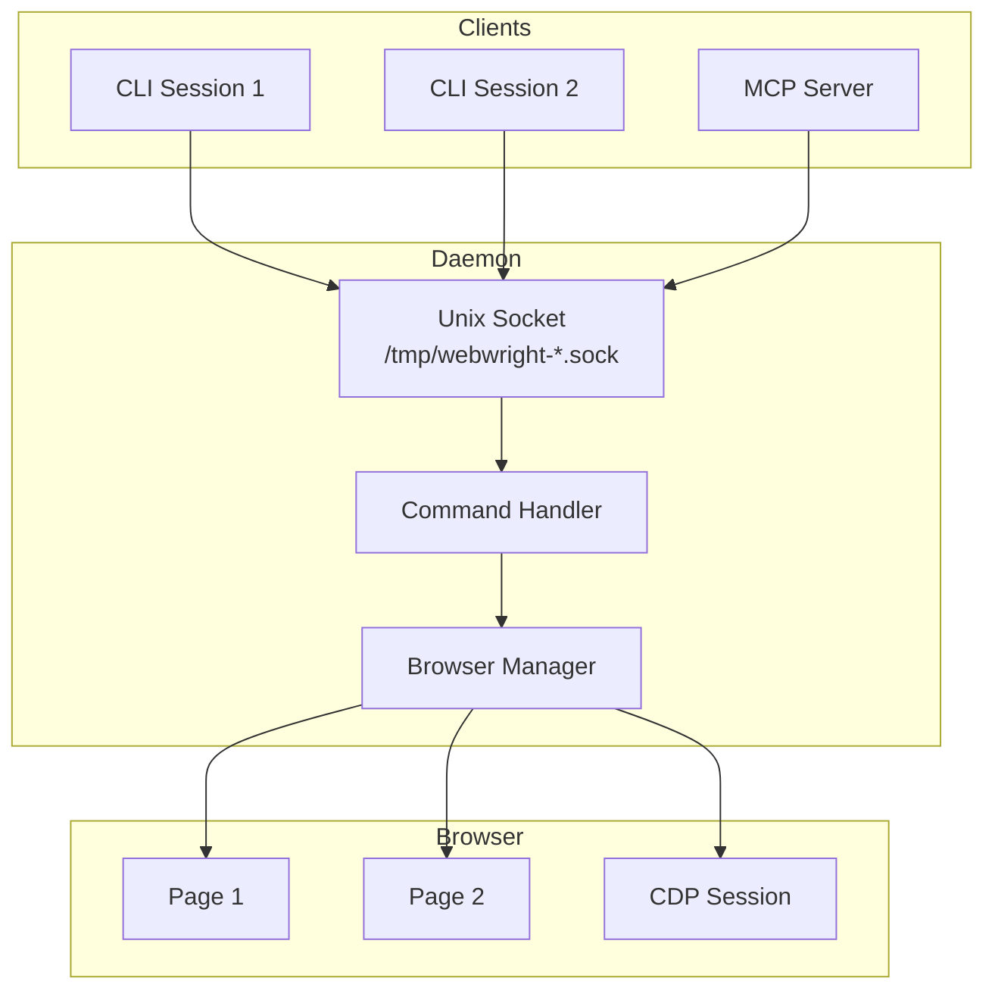

The daemon starts automatically on first command and persists between commands for fast operations.

---

## Performance

| Operation | Node.js CLI | With Daemon |
|-----------|-------------|-------------|
| First command | ~2s | ~2s (daemon startup) |
| Subsequent commands | ~500ms | ~50ms |
| Snapshot | ~200ms | ~200ms |
| Click | ~100ms | ~100ms |

### Token Reduction

```bash
# Full snapshot: ~5000 tokens
webwright snapshot

# Interactive only: ~500 tokens (90% reduction)
webwright snapshot --interactive

# Great for keeping AI context usage low
```

---

## Node.js API

```typescript
import { BrowserManager, getEnhancedSnapshot } from 'webwright';

const browser = new BrowserManager();

// Launch browser
await browser.launch({ headless: true });

// Navigate
await browser.getPage().goto('https://example.com');

// Get snapshot with refs
const snapshot = await getEnhancedSnapshot(browser.getPage(), {
  interactive: true,
});

console.log(snapshot.tree);
// - heading "Example Domain" [ref=e1] [level=1]
// - link "More information..." [ref=e2]

// Set refs for locator resolution
browser.setRefMap(snapshot.refs);

// Click using ref
await browser.getLocator('@e2').click();

// Close
await browser.close();
```

---

## Development

```bash
# Clone repository
git clone https://github.com/isaacmorgado/webwright
cd webwright

# Install dependencies
npm install

# Build TypeScript
npm run build

# Run tests
npm test

# Start daemon manually
npm run dev
```

---

## License

Apache-2.0

---

## Links

- **GitHub**: https://github.com/isaacmorgado/webwright
- **Issues**: https://github.com/isaacmorgado/webwright/issues
